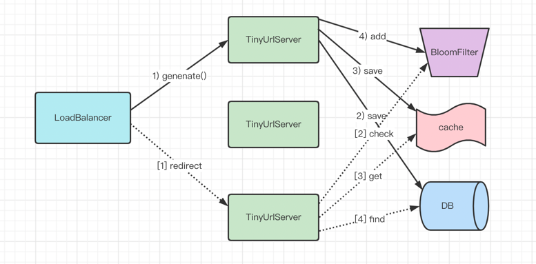

# Tiny Url by Go

- go web framework: [Gin](https://github.com/gin-gonic/gin)
- generate tiny Url by [base58](https://github.com/itchyny/base58-go)
- use DynamoDB
- use redis cache hotspot data
- add bloomFilter
